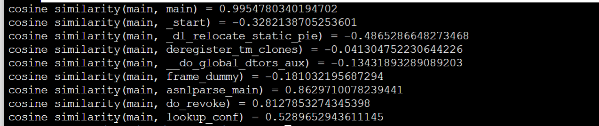

# OPTango
OPTango: Multi-central Representation Learning against Innumerable Compiler Optimization for Binary Diffing 

----------------------------------------------------------------------------------------------

## Environment Setup:

- Linux 
- Python 3.8
- PyTorch 1.12.0
- CUDA 11.3
- IDA pro 7.5+ (only used for dataset processing)


## where is data and model weight?

[OPTBinary (Google Driver)](https://1drv.ms/u/s!AnDeWkMIPHF2bAXxVVcWM-kAmqQ?e=YFWYeZ)

[Optimization Settings of OPTBinary (Google Driver)](https://1drv.ms/u/s!AnDeWkMIPHF2a6uhaspwRv3KQ2I?e=lGtJh6)

[Model Weight (Google Driver)](https://1drv.ms/u/s!AnDeWkMIPHF2aqmD_b9Ecxy7oKk?e=fpW6YN)

1. download OPTBinary(bin.zip) and unzip as data/data-bsca/bin (not need if you just want to use OPTango, refer to 
   third/jTrans/datautils/README.md for preprocessing data)
2. download model_weight.zip and unzip as model_weight/

## Getting Started:
a. Create a conda virtual environment and activate it.
```shell
conda create -n optango python=3.8 -y
conda activate optango
```

b. Install PyTorch and other packages.
```shell
conda install pytorch==1.12.0 torchvision==0.13.0 torchaudio==0.12.0 cudatoolkit=11.3 -c pytorch
pip install -r requirements.txt
```

c. Feature extracting and similarity matching
```shell
python how_to_use.py
```

d. Matching result
The following diagram illustrates the cosine similarity between the query function "main" and nine index functions using OPTango:




## Normal issue
1. transformers version problem
```shell
Traceback (most recent call last):
  File "how_to_use.py", line 194, in <module>
    main()
  File "how_to_use.py", line 172, in main
    model = FullModel("cuda:0", with_gp=eval(args.with_gp))
  File "how_to_use.py", line 98, in __init__
    model.load_state_dict(checkpoint["bert"])
  File "/home/hng/miniconda3/envs/optango2/lib/python3.8/site-packages/torch/nn/modules/module.py", line 1604, in load_state_dict
    raise RuntimeError('Error(s) in loading state_dict for {}:\n\t{}'.format(
RuntimeError: Error(s) in loading state_dict for OptRemoveBertModel:
        Unexpected key(s) in state_dict: "bert.embeddings.position_ids".
```

```shell
pip uninstall transformers
pip install transformers=4.28.0
```